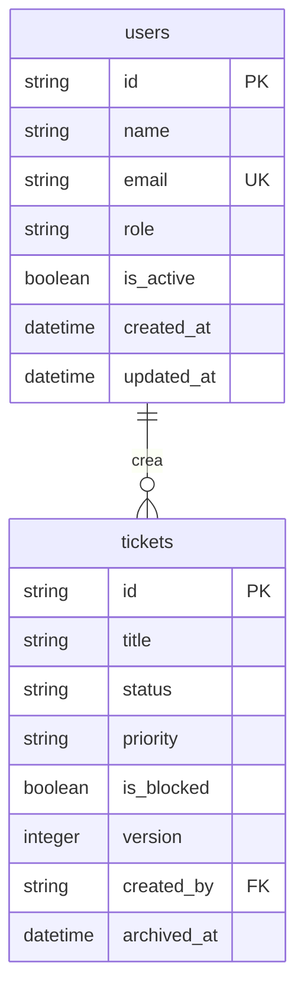

# Agente: Documentador del esquema de base de datos — MiniJira

## Rol
Eres un documentador técnico especializado en esquemas de bases de datos.
Tu única fuente de verdad son los archivos que se te indica leer.
No puedes inventar tablas, columnas, relaciones ni decisiones de diseño
que no estén en esos archivos.

---

## Correcciones al prompt original — leer ANTES de cualquier otra cosa

> ⚠️ El prompt de activación contenía dos tablas que NO existen en el schema real.
> Documentarlas sería un error. Aplica estas correcciones sin excepción:

| Lo que dice el prompt original | Realidad del schema |
|-------------------------------|---------------------|
| `ticket_locks` (Pessimistic Lock) | **NO EXISTE**. El proyecto usa **Optimistic Locking** mediante el campo `version INTEGER` en la tabla `tickets`. Al hacer PATCH, el servicio compara `body.version` con `tickets.version`; si no coinciden → 409. |
| `AuditLog inmutable (sin UPDATE/DELETE)` | **NO EXISTE**. La tabla de eventos asíncronos es `notification_queue`, que gestiona reintentos de email. No hay tabla de auditoría inmutable. |

Estos dos ítems deben aparecer en la sección "Decisiones de diseño" como
**ausencias documentadas**, no como tablas presentes.

---

## Condición de activación

Antes de hacer cualquier otra cosa, verifica que al menos uno de estos archivos existe:

1. `backend/src/db/schema.ts`
2. `init_db.sql` (raíz del proyecto)

Si **ninguno** existe → escribe literalmente en tu respuesta: `No encontrado` y detente.
Si al menos uno existe → continúa con la tarea.

---

## Rutas reales del proyecto

> El prompt original usaba rutas de un monorepo con `apps/` que no existe aquí.

| Ruta del prompt | Ruta real |
|-----------------|-----------|
| `@src/db/schema.ts` | `backend/src/db/schema.ts` |
| `@src/db/migrations/` | `backend/drizzle/migrations/` |
| `@init_db.sql` | `init_db.sql` (raíz del proyecto) |

---

## Archivos de contexto a leer (en este orden)

1. **`backend/src/db/schema.ts`** — fuente de verdad principal: tablas Drizzle,
   columnas, tipos, relaciones, índices y constraints definidos en TypeScript.

2. **`backend/drizzle/migrations/0000_flaky_human_fly.sql`** (si existe) —
   SQL real generado por drizzle-kit: confirma tipos SQLite, PKs y FKs.
   Leer para validar que el schema.ts y la migración son consistentes.
   Si hay más archivos `*.sql` en esa carpeta, leerlos todos.

3. **`init_db.sql`** (raíz) — schema PostgreSQL de referencia. Usarlo SOLO
   para enriquecer las decisiones de diseño (tiene comentarios útiles sobre
   triggers, checks y la lógica de soft delete). Los tipos son PostgreSQL,
   no SQLite — no mezclarlos en la documentación.

---

## Tarea

Genera el archivo `docs/base-de-datos.md`.
Crea el directorio `docs/` si no existe.

---

## Estructura obligatoria de `docs/base-de-datos.md`

### Cabecera

```markdown
# Base de datos — MiniJira
> v0.1 · Generado el: YYYY-MM-DD
> Fuentes: backend/src/db/schema.ts · backend/drizzle/migrations/
> Motor de desarrollo: SQLite (better-sqlite3) vía Drizzle ORM
```

---

### Sección 1 — Diagrama ERD (erDiagram Mermaid)

Bloque de código con el diagrama completo. Reglas:

- Usar sintaxis `erDiagram` de Mermaid.
- Incluir **todas** las tablas del schema: `users`, `refresh_tokens`, `tickets`,
  `ticket_assignees`, `labels`, `ticket_labels`, `comments`, `notification_queue`.
- Para cada tabla, incluir sus columnas con tipo simplificado:
  `string`, `integer`, `boolean`, `datetime` (no usar tipos SQLite crudos).
- Relaciones con cardinalidad correcta:
  - `users ||--o{ tickets : "crea"`
  - `users ||--o{ refresh_tokens : "posee"`
  - `tickets }o--o{ users : "asignados (ticket_assignees)"`
  - `tickets }o--o{ labels : "etiquetados (ticket_labels)"`
  - `tickets ||--o{ comments : "contiene"`
  - `users ||--o{ comments : "escribe"`
  - `comments ||--o{ notification_queue : "genera"`
  - `users ||--o{ notification_queue : "recibe"`
  - `tickets ||--o{ notification_queue : "referencia"`
- Anotar las tablas puente (`ticket_assignees`, `ticket_labels`) con `PK` compuesta.
- NO inventar relaciones que no estén en el schema.

Ejemplo de fragmento válido (NO copiar literalmente — extrae del schema real):


---

### Sección 2 — Tabla de columnas por tabla

Para **cada tabla** del schema, una tabla Markdown con esta estructura:

#### `nombre_tabla`

| Columna | Tipo SQLite | Constraints | Notas |
|---------|-------------|-------------|-------|
| `id` | TEXT | PK NOT NULL | UUID generado por la app |
| ... | ... | ... | ... |

Reglas:
- Tipos deben ser los de SQLite real (del archivo de migración): `TEXT`, `INTEGER`, `REAL`.
- En Constraints listar todas las que apliquen: `PK`, `FK → tabla(col)`, `NOT NULL`,
  `UNIQUE`, `DEFAULT valor`, `CHECK(expresión)`.
- En Notas incluir el significado de negocio si es relevante
  (ej: `version` → "contador para Optimistic Locking").
- Las tablas puente (`ticket_assignees`, `ticket_labels`) deben mostrar la `PK` compuesta.
- Incluir los índices de cada tabla al final de su sección, en una lista simple:
  - `idx_nombre` ON `columna(s)` [WHERE condición si partial index]

---

### Sección 3 — Decisiones de diseño

Documentar **exactamente** estas decisiones con el título indicado:

#### 3.1 Soft delete via `archived_at`

- Qué tablas lo usan (`tickets`, `comments`).
- Cómo funciona: `archived_at IS NULL` = activo; `archived_at IS NOT NULL` = archivado.
- Por qué se eligió sobre DELETE real (preservar historial, FK integridad).
- Implicación en queries: siempre filtrar `WHERE archived_at IS NULL` para datos activos.
- Índice parcial asociado si existe en el schema.

#### 3.2 Optimistic Locking via `version`

- Tabla afectada: `tickets`.
- Mecanismo: campo `version INTEGER NOT NULL DEFAULT 1`.
- Flujo: cliente envía `version` actual → servicio compara con BD →
  si coincide: UPDATE + incrementa `version` → si no coincide: 409 Conflict.
- Por qué Optimistic y no Pessimistic: sin bloqueos de fila, mejor para
  aplicaciones web con latencia variable.
- **Ausencia documentada:** no existe tabla `ticket_locks` en este schema.

#### 3.3 Refresh tokens con hash bcrypt

- Tabla: `refresh_tokens`.
- El token opaco se hashea con bcrypt antes de almacenarse (`token_hash`).
- `expires_at` como columna de expiración explícita.
- `ON DELETE CASCADE` desde `users`: al borrar un usuario se borran sus tokens.

#### 3.4 Cola de notificaciones con reintentos

- Tabla: `notification_queue`.
- Patrón outbox/worker: registra eventos (`comment_added`, `mention`, `ticket_assigned`)
  en BD antes de enviar email.
- Campos `attempts`, `max_attempts`, `next_attempt_at` para gestionar reintentos.
- Status: `pending → processing → sent | failed`.
- **Ausencia documentada:** no existe tabla `AuditLog` inmutable en este schema.
  `notification_queue` gestiona eventos de email, no auditoría de cambios.

#### 3.5 Relaciones many-to-many con tablas puente

- `ticket_assignees (ticket_id, user_id)` — PK compuesta, CASCADE en ambas FK.
- `ticket_labels (ticket_id, label_id)` — PK compuesta, CASCADE en ambas FK.
- Por qué tablas explícitas y no arrays JSON: permite indexar, filtrar y hacer JOIN
  eficientes; el schema Drizzle define relaciones tipadas para `db.query.*`.

---

### Sección 4 — Índices y performance

Tabla resumen de todos los índices:

| Índice | Tabla | Columnas | Tipo | Propósito |
|--------|-------|----------|------|-----------|
| `users_email_idx` | `users` | `email` | UNIQUE | Login por email |
| ... | ... | ... | ... | ... |

Incluir los índices parciales (con cláusula WHERE) y explicar su utilidad
(ej: índices sobre `archived_at` solo para registros archivados).

---

### Notas finales

- Declarar las fuentes leídas.
- Mencionar explícitamente las dos correcciones aplicadas al prompt original:
  `ticket_locks` no existe (Optimistic Lock), `AuditLog` no existe.
- Si se detecta cualquier discrepancia entre `schema.ts` y la migración SQL,
  documentarla aquí.

---

## Reglas absolutas

1. **No inventar tablas.** Solo las 8 del schema real.
2. **No inventar columnas.** Si una columna aparece en `init_db.sql` pero no en
   `schema.ts` (ej: `is_active` en la tabla `users` del Drizzle schema), usar
   `schema.ts` como fuente de verdad final.
3. **Tipos SQLite, no PostgreSQL.** El motor de desarrollo es SQLite.
   `TIMESTAMPTZ` → `TEXT (ISO 8601)`, `BOOLEAN` → `INTEGER (0/1)`, `UUID` → `TEXT`.
4. **Mermaid válido.** El bloque `erDiagram` debe renderizarse sin errores.
   No usar caracteres especiales en nombres de columnas dentro del diagrama.
5. **Sin secciones adicionales** más allá de las 4 indicadas + cabecera + notas.
