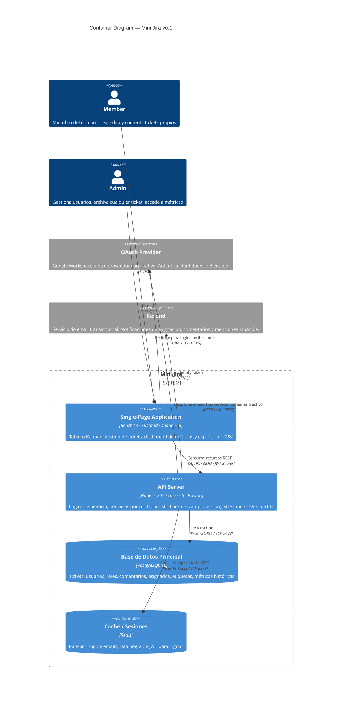

# C4 Model — Nivel Contenedores — Mini Jira v0.1

---

## Decisiones de diseño

| Elemento | Justificación |
|---|---|
| SPA separada del API | Permite cachear assets estáticos en CDN y escalar el API independientemente |
| API única (monolito modular) | Equipo de 10 personas, 3 semanas; microservicios sería over-engineering en v1 |
| Redis fuera del boundary de DB | Rol distinto: no persiste datos de negocio, solo estado de sesión y control de rate |
| `Rel(api → resend)` con descripción de lógica | El EC-1 del backlog exige que la API verifique si el comentario sigue activo *antes* de llamar a Resend |
| OAuth externo con doble flecha | La SPA maneja el redirect; el API valida el token — flujo Authorization Code estándar |
